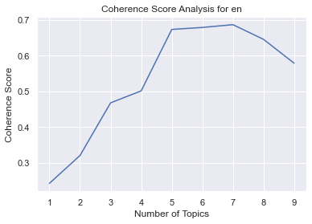

# **Proofpoint AI Engineer - Bhavesh Chainani**
Technical Exercise - Proofpoint

This README will explain the end-to-end analysis on topic modelling. It will explain in detail with regards to 5 main aspects, primarily focusing on 3 language models, English (en), Russian (ru) and Italian (it).

1. Document Extraction
2. Language Detection
3. Text Processing
4. Clustering documents into logical groups (for each language)
5. Results and Discussion

# **File Information**
1. README.md - contains information about the project
2. topic_modelling.py - code in py format
3. requirements.txt - requirements file with relevant python packages required
4. scripts
    - /wikipedia_scraping.py - contains the script to extract wikipedia articles in different languages and save the dataframe in input/ folder
    - /topic_modelling.py - contains the script to identify the language, preprocess and group the data using LDA
    - /hyperparameter_tuning - contains an example of in-depth hyper-parameter tuning done to account for different parameters so as to maximise coherence score.
    - /topic_modelling_further_analysis.ipynb - contains some examples of hyperparameter tuning done
5. files
   - /input - contains the input dataframe for running the topic modelling algorithm
   - /output - contains the output dataframe, coherence plot and visualisation file for each language [en, ru, it]
   - /documentation - accompanying images to be included in this README.md file


## **Usage**

### Step 1:
Create a virtual environment, and run requirements.txt in that venv to install the relevant packages.
```python
pip install -r requirements.txt
```

### Step 2.
(Optional) Run the web scraping file to extract the relevant content of 51 celebrities from wikipedia in 3 different languages,
English (en), Russian (ru) and Italian (it). This code is optional as the dataframe has already been stored as files/input/combined_data.xlsx. Running the code will overwrite the excel file in the aforementioned directory.
```python
python scripts/wikipedia_scraping.py 
```

### Step 3.
Run the topic modelling algorithm (LDA) with the specified language of interest as a parameter. For this project, we will be solely focusing on the 3 different languages as specified (en, ru, it). 

```python
# run python file to do topic modelling for language of interest
python scripts/topic_modelling.py <lang> (change <lang> parameter to language of interest [en, ru, it])
# eg. python scripts/topic_modelling.py en
# eg. python scripts/topic_modelling.py "en" 
```

The code will generate 3 files, which will be stored in the output/[lang] folders respectively for each language. 
1. topic_modelling_output_[lang].xlsx
This file will showcase the dominant topics for content with regards to that particular actor, as well as relevant topic keywords.

2. coherence_score_[lang].png
This file will showcase an example of hyperparameter tuning done, to identify the number of topics to use so as to maximise the coherence score.

3. lda_[lang].html
This file is an interactive visualisation plot for the user to see how many topics are used for each language and which are the most salient terms for each topic.

# **Explanation of Code (Automatic Document Clustering)**

### **1. Document Extraction (scripts/wikipedia_scraping.py)**

I used Wikipedia to source the content of 51 random celebrities. Such data can be scraped using packages such as *BeautifulSoup4*. However, wikipedia has a python package, *wikipedia*, which allows us to set the language of interest and query content of those articles in that particular langauge.

Hence I query articles of these 51 celebrities in 3 different languages: English, Italian and Russian. Attached is a snippet of the code of how such data is queried, while setting the language.

```python
articles = ['George_Clooney', 'Shah_Rukh_Khan', 'Leonardo_DiCaprio'] #snippet of actual number of articles
print("Obtaining English data now")
wikipedia.set_lang("en")
content = []
person = []

for i in articles:
#     print("Examining " + str(i))
    person.append(wikipedia.page(i, auto_suggest=False).title) ##appending title to list
    content.append(wikipedia.page(i, auto_suggest=False).content) ## appending content to list
    
df = pd.DataFrame(list(zip(person,content)), columns=['person', 'content'])
## combine all three df's into df_comb
```

I query the content and name of these celebrities in all three languages and append it to a dataframe. Written below is an example of the dataframe.


| **name**          | **content**                                       |
|-------------------|---------------------------------------------------|
| George Clooney    | George Timothy Clooney (born May 6, 1961) is a... |
| Shah Rukh Khan    | Shah Rukh Khan (pronounced [ˈʃɑːɦɾʊx xɑːn]; bo... |
| Leonardo DiCaprio | Leonardo Wilhelm DiCaprio (; Italian: [diˈkaːp... |

This dataframe, containing the content of all 3 different languages, is then saved and stored in the files/input folder as combined_data.xlsx


### **2. Language Detection (scripts/topic_modelling.py)**
I will be using the package *langdetect* to separate the language and only filter the rows based on my intended language. It is important to set the DetectorFactory seed to ensure reproducibility of results. As we are aware that these articles are only in these three languages, it is still important to detect the language of the content, should there be any future data of different languages which we wish to add to our dataset.

```python
from langdetect import detect, DetectorFactory, detect_langs
#set seed for reproducibility of results
DetectorFactory.seed = 0
df_comb["actual_lang"] = df_comb["content"].apply(detect)
```

Written below is a sample of 5 rows after the language detection has been done and the new *actual_lang* column has been added.

|   |            name |                                           content | actual_lang |
|--:|----------------:|--------------------------------------------------:|------------:|
| 0 | Michael_Jackson |   Майкл Джо́зеф Дже́ксон (англ. Michael Joseph J... |          ru |
| 1 |      Bruno_Mars | Bruno Mars, pseudonimo di Peter Gene Hernandez... |          it |
| 2 |    Donald_Trump | Donald John Trump (AFI: [ˈdɑnəɫd ˈʤɑn ˈtʰɹʌmp]... |          it |
| 3 |         Shakira | Shakira Isabel Mebarak Ripoll ( shə-KEER-ə, Sp... |          en |
| 4 |      Larry_Page | Lawrence Page, detto Larry (East Lansing, 26 m... |          it |

### **3. Text Processing**

In the field of NLP, text preprocessing is the process of cleaning and preparing the data. I will be using the open-source software library called *spaCy* to prepare the data for analysis, but other libraries such as *NLTK* can be used.

I will be using 3 of spacy's pre-trained models for each language. The model, which I will call 'nlp', can be thought of as a pipeline. When you call 'nlp' on a text or word, the text runs through a processing pipeline, which is depicted below. It means that if the text is not tokenized, it will then be tokenized, and afterwards, different components (tagger, parser, ner etc.) will be activated. To tokenize text means turning a string or document into smaller chunks (tokens). 

As we are doing topic analysis on 3 separate languages, I will run the relevant *spaCy* medium models for the three languages, English (en), Italian (it) and Russian (ru).


The most interesting component in the pipeline is the tagger which assigns Part-Of-Speech (POS) tags based on SpaCy's English language model to gain a variety of annotations.  We can use the POS tags to preprocess the data by removing unwanted tags. Assuming we want to remove all numbers in our text, we can then point at a specific tag and remove it.

In this example, I will focus on filtering the data for those rows in "en", and will preprocess the text after that. 

```python
lang = sys.argv[1] ##lang is specified in the parameter <lang> when we run the script
lang_models = {"en": spacy.load("en_core_web_md"), "it": spacy.load("it_core_news_md"), "ru": spacy.load("ru_core_news_md")}
df = df_comb[df_comb["actual_lang"] == lang].reset_index(drop=True)
```

I will focus on the 'content' column, where I will tokenize, lemmatize and remove stopwords (*is_stop*) for each language of interest, while keeping alphabetic characters (*is_alpha*)


```python
# Tags I want to remove from the text
removal= ['ADV','PRON','CCONJ','PUNCT','PART','DET','ADP','SPACE', 'NUM', 'SYM']
tokens = []
for summary in nlp.pipe(df["content"]):
    proj_tok = [token.lemma_.lower() for token in summary if token.pos_ not in removal and not token.is_stop and token.is_alpha]
    tokens.append(proj_tok)
```

Showcased below is the updated dataframe snippet with the tokens appended to the corresponding information

|   |            person |                                           content | actual_lang |                                            tokens |
|--:|------------------:|--------------------------------------------------:|------------:|--------------------------------------------------:|
| 0 |    George Clooney | George Timothy Clooney (born May 6, 1961) is a... |          en | [george, timothy, clooney, bear, american, act... |
| 1 |    Shah Rukh Khan | Shah Rukh Khan (pronounced [ˈʃɑːɦɾʊx xɑːn]; bo... |          en | [shah, rukh, khan, pronounce, ˈʃɑːɦɾʊx, xɑːn, ... |
| 2 | Leonardo DiCaprio | Leonardo Wilhelm DiCaprio (; Italian: [diˈkaːp... |          en | [leonardo, wilhelm, dicaprio, italian, diˈkaːp... |

As we can see, some of these tokens have different languages, even though the dataframe has already been filtered to focus on english-detected texts. Some of these texts in different languages may be important, especially if they have a high frequency and are not stop words. Hence, I will leave such words in, which may then be filtered out when we create our dictionary.

### Create Dictionary and Corpus

The two main inputs to the topic model which I will be using (LDA) are the dictionary and the corpus:

Dictionary: The idea of the dictionary is to give each token a unique ID.
Corpus: Having assigned a unique ID to each token, the corpus simply contains each ID and its frequency. LDA is a "bag-of-words" model, which means that the order of words does not matter.

I will apply the Dictionary Object from Gensim, which maps each word to their unique ID, and will filter out low-frequency and high-frequency tokens, limiting the vocabulary to a max of 1000 words.

```python
dictionary.filter_extremes(no_below=5, no_above=0.5, keep_n=1000) #keep 1000 most unique tokens
```

Showcased below is part of the filtered dictionary.

**{'abuse': 0, 'accept': 1, 'acclaim': 2, 'accolade': 3, 'account': 4, 'accuse': 5, ... }**

I will construct the corpus using the above filtered dictionary and the doc2bow function. The function doc2bow() simply counts the number of occurrences of each distinct word, converts the word to its integer word id and returns the result as a sparse vector. In order words, this function converts a collection of words to its bag-of-words representation: a list of (token_id, token_count) 2 tuples.

```python
corpus = [dictionary.doc2bow(doc) for doc in df['tokens']]
print(corpus[:1])
```

```[[(0, 1), (1, 1), (2, 4), (3, 1), (4, 1), (5, 1), (6, 2) ... ]]```

Gensim creates a unique id for each word in the document. The produced corpus shown above is a mapping of (word_id, word_frequency). For example, (0, 1) above implies, word id 0 occurs once in the first document. Likewise, word id 2 occurs four times and so on.

### **4. Cluster Documents into Logical Groups**

The next step is to train the unsupervised machine learning model on the data. There are many models which can be used for clustering of such documents, such as Latent Semantic Analysis (LSA), and Latent Dirichlet Allocation (LDA). As mentioned above, in this case I choose to work with LDA. The purpose of LDA is mapping each document in our corpus to a set of topics which cover a good deal of words in that document. 

I choose to work with the LdaMulticore, which uses all CPU cores to parallelize and speed up model training. 

When inserting our corpus into the topic modelling algorithm, the corpus gets analyzed in order to find the distribution of words in each topic and the distribution of topics in each document.

As input, I give the model our corpus and dictionary from before; besides, I choose to iterate over the corpus 100 times to optimize the model parameters. The pass is 10, which means the model will pass through the corpus ten times during training.

I first pass a baseline model, setting the number of topics to 10.

*chunk_size* is the number of documents to be used in each training chunk
*passes* is the total number of training passes
*per_word_topics* allows the model to compute a list of topics, sorted in descending order of most likely topics of each word

```python
lda_model = LdaMulticore(corpus=corpus,
                       id2word=dictionary,
                       num_topics=10, 
                       random_state=100,
                       iterations=100,
                       chunksize=100,
                       passes=10,
                       per_word_topics=True)
```

We can print the keywords in th 10 topics for this baseline model

```
[(0,
  '0.067*"king" + 0.045*"rock" + 0.028*"novel" + 0.019*"publish" + '
  '0.015*"match" + 0.013*"championship" + 0.012*"character" + 0.011*"episode" '
  '+ 0.008*"football" + 0.007*"read"'),
 (1,
  '0.071*"india" + 0.046*"page" + 0.034*"indian" + 0.027*"score" + '
  '0.023*"match" + 0.021*"test" + 0.012*"romance" + 0.011*"ceo" + '
  '0.010*"average" + 0.009*"century"'),
 (2,
  '0.089*"defeat" + 0.057*"match" + 0.056*"grand" + 0.038*"french" + '
  '0.031*"court" + 0.026*"ranking" + 0.026*"round" + 0.025*"season" + '
  '0.022*"double" + 0.019*"era"'),
 (3,
  '0.061*"clinton" + 0.033*"obama" + 0.023*"law" + 0.021*"election" + '
  '0.015*"presidential" + 0.011*"bill" + 0.010*"political" + 0.009*"health" + '
  '0.009*"vote" + 0.009*"hillary"'),
 (4,
  '0.061*"season" + 0.058*"player" + 0.057*"score" + 0.053*"goal" + '
  '0.050*"match" + 0.035*"league" + 0.021*"defeat" + 0.021*"finish" + '
  '0.020*"cup" + 0.016*"injury"'),
 (5,
  '0.074*"album" + 0.045*"song" + 0.042*"music" + 0.024*"artist" + '
  '0.020*"tour" + 0.019*"chart" + 0.019*"awards" + 0.018*"billboard" + '
  '0.014*"studio" + 0.014*"uk"'),
 (6,
  '0.030*"actor" + 0.018*"drama" + 0.013*"comedy" + 0.013*"box" + '
  '0.012*"nomination" + 0.011*"gross" + 0.011*"awards" + 0.011*"direct" + '
  '0.010*"critical" + 0.009*"production"'),
 (7,
  '0.012*"private" + 0.010*"worth" + 0.010*"cross" + 0.009*"purchase" + '
  '0.009*"energy" + 0.009*"net" + 0.009*"ceo" + 0.008*"found" + 0.008*"brown" '
  '+ 0.008*"computer"'),
 (8,
  '0.028*"party" + 0.013*"russia" + 0.013*"russian" + 0.013*"government" + '
  '0.013*"leader" + 0.012*"minister" + 0.012*"election" + 0.011*"china" + '
  '0.009*"policy" + 0.009*"secretary"'),
 (9,
  '0.059*"novel" + 0.021*"brown" + 0.019*"publish" + 0.013*"character" + '
  '0.012*"fiction" + 0.011*"writing" + 0.010*"copy" + 0.010*"read" + '
  '0.009*"british" + 0.009*"daughter"')]
```

### **Compute Model Perplexity and Coherence Score**

Model perplexity and topic coherence provide a convenient measure to judge how good a given topic model. In this project, I will particularly focus on topic coherence score, by identifying the number of topics which maximises this metric. The Coherence score creates content vectors of words using their co-occurrences and, after that, calculates the score using normalized pointwise mutual information (NPMI) and the cosine similarity. This snippet of code showcases how the scores and topic numbers are iterated through the model.

```python
topics = []
score = []
for i in range(1,10,1):
    print("Running iteration number " + str(i))
    lda_model = LdaMulticore(corpus=corpus, id2word=dictionary, iterations=100, num_topics=i, workers = 4, passes=10, random_state=100, chunksize=100)
    cm = CoherenceModel(model=lda_model, texts = df['tokens'], corpus=corpus, dictionary=dictionary, coherence='c_v')
    topics.append(i)
    score.append(cm.get_coherence())
```

For the English language text in our corpus, the optimal number of topics to maximise coherence score is 7.



#### **Further Hyperparameter Tuning**

Now that we have the baseline coherence score for the default LDA model, we can perform a series of sensitivity tests to help determine the following model hyperparameters:

Number of Topics (K)
Dirichlet hyperparameter alpha: Document-Topic Density
Dirichlet hyperparameter beta: Word-Topic Density

These tests will be performed in sequence, one parameter at a time by keeping others constant and run them over the two different validation corpus sets. We’ll use C_v as our choice of metric for performance comparison.

These tests have been performed on the English corpora and saved in the "./files/output/en" folder.

Due to memory constraints, I will only be changing the number of topics for all three languages, and will not change the alpha and beta values, given that the change in coherence score is not that much.

The most ideal model will be to use LDAMulticore, which parallelizes and maximises CPU usage to increase runtime.

Also, due to memory constraints and assuming that the end-user is running the model on a CPU, I have saved the models for all three languages

### **5. Finding Optimal Number of Topics**

Having trained the model, the next natural step is to evaluate it. After having constructed the topics, a coherence score can be computed. The score measures the degree of semantic similarity between high scoring words in each topic. In this fashion, a coherence score can be computed for each iteration by inserting a varying number of topics.

A range of algorithms has been introduced to calculate the coherence score (C_v, C_p, C_uci, C_umass, C_npmi, C_a, …). Working with the gensim library makes computing these coherence measures for topic models fairly simple. I personally choose to implement C_v and C_umass. The coherence score for C_v ranges from 0 (complete incoherence) to 1 (complete coherence). Values above 0.5 are fairly good, according to John McLevey

Below I simply iterate through a different number of topics and save the coherence score in a list. Afterwards, I plot using seaborn.

When looking at the coherence using the C_umass or C_v algorithm, the best is usually the max. Looking at the graphs I choose to go with 6 topics, although no certain answer can be given. 

Further hyperparameter tuning is done to get the optimal alpha and beta value along with the optimal C_v score.

For all three languages, the optimal number of topics is 5. This does not mean that all these 5 topics may be the same, given how each word interacts with one another for these 3 different languages.

### Visualisation

I use PCA to reduce the dimensionality of the data and visualise the output, using pyLDAvis.

As we have shown earlier, we can evaluate the topic clustering results by reviewing all the topics and their associated words case by case. This is totally fine, but may not be very convenient especially when the cluster counts get larger. Luckily, there is a popular visualization package that can be used to visualize the topic clusters in an interactive manner. On a high level, there are mainly two interactive elements in the generated plot you can play with:

The relevance metrics λ. Relevance denotes the degree to which a term appears in a particular topic to the exclusion of others. When λ = 1, the terms are ranked by their probabilities within the topic (the ‘regular’ method) while when λ = 0, the terms are ranked only by their lift. Lift is the ratio of a term’s probability within a topic to its margin probability across the corpus. On a high level, the lift is trying to measure similar effects as TF-IDF vectorization.
Inter-topic Distance Map. The user is able to navigate through different topic clusters in the GUI here, and users can have a good overview of how different topic clusters are separated from each other also. Generally speaking, the further away between all the topic clusters, the better the segmentation results are.


## Results & Discussion

Researchers have developed approaches to obtain an optimal number of topics by using Kullback Leibler Divergence Score. Hence this can be used in place of the score to get a more accurate understanding on the number of topics to use.

LDA also ignores syntactic information and treats documents as bags of words. It also assumes that all words in the document can be assigned a probability of belonging to a topic. That said, the goal of LDA is to determine the mixture of topics that a document contains.

Common LDA limitations:
    1. Fixed K (the number of topics is fixed and must be known ahead of time)
    2. Uncorrelated topics (Dirichlet topic distribution cannot capture correlations)
    3. Non-hierarchical (in data-limited regimes hierarchical models allow sharing of data)
    4. Static (no evolution of topics over time)
    5. Bag of words (assumes words are exchangeable, sentence structure is not modelled)
    6. Unsupervised (sometimes weak supervision is desirable, e.g in sentiment analysis)


## Discussion

1. Benefits of LDA
As we are looking at large chunks of content for each celebrity, LDA can be used for easier interpretation to understand the type of topics each article contains.

## 2. Disadvantages of LDA
#### Inability to scale
LDA has been criticized for not being able to scale due to the linearity of the technique it is based on. Hence, besides LDA, we can try other variants such as pLSI, the probabilistic variant of LSI, which solves this challenge by using a statistical foundation and working with a generative model.

#### Self interpreation of topics
Using LDA for topic modelling results in the user's interpretability of what each topic group should be labelled as.

With various languages, with hyperparameter tuning, the optimal number of topics are different, hence it is difficult to identify the number of topics to apply LDA model on across these three different langauges.

Once trained, most topic models cannot deal with unseen words, this is because they are based on Bag of Words (BoW) representations, which cannot account for missing terms.

## Proposing a better model

Overcoming that issue using Zero-shot cross-lingual topic modeling with ZeroShotTM, able to retrain the model just using English corpus then test on unseen corpus of different languages using multilingual BERT. This utilises transfer learning, assuming that our main form of interpretation is English and that these documents are the same (which applies in this case).

There is one key assumption for this project as these documents are all the same, but in different languages. Hence it is not ideal if there are documents of different languages and similar contents which we want to group together.

So why we need another kind of topic model for multilingual datasets when we can just apply LDA on documents from each language separately? The main advantage of MLTM over this approach is that MLTM aligns topics across languages while LDA cannot guarantee this. This is important because one of the benefits of MLTM is that it can be used for cross-lingual document retrieval. For instance, a user might find a German news article of interest and wants to find similar articles in French or Finnish. Without any knowledge of these languages we can retrieve such articles quickly using MLTM.


## Contributers
#### Bhavesh Chainani
#### Data Scientist
#### August 2022

